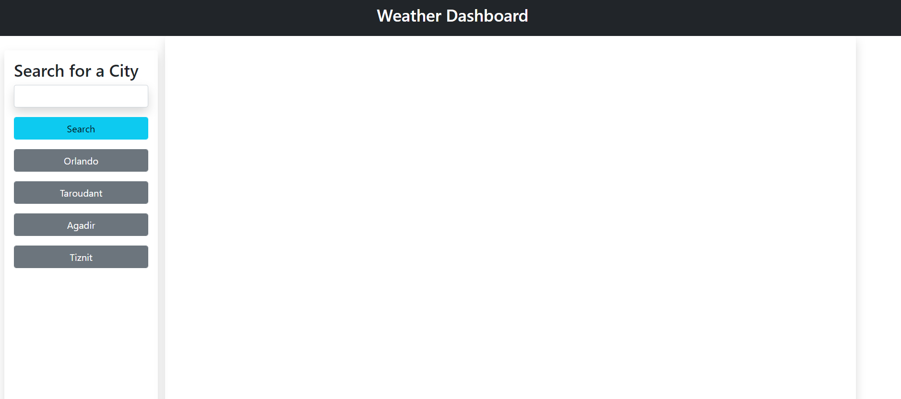
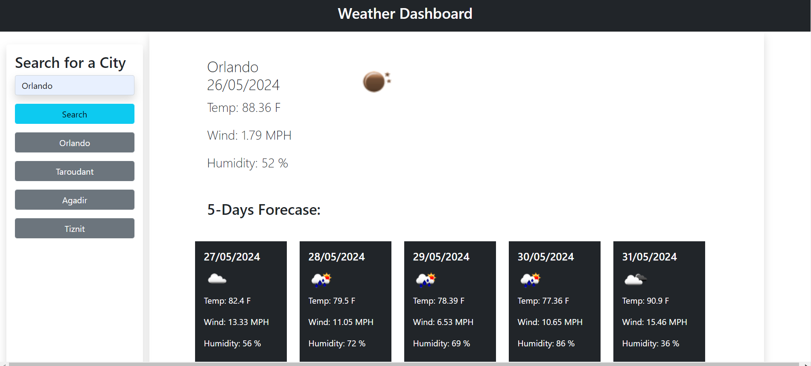
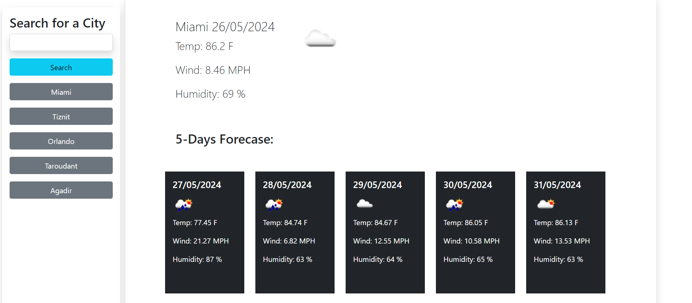

# Weather-dashboard

## Description
The weather dashboard provide weather's information in 6 days range. Left bar contain search input that uses city to search, and added the name of the city to the history. History bar displayed the last city searched for in the top.

## Installation

N/A

## Usage

- Type the city you would like to search for in the search bar.
- Information will be display to right, 
- Information for the current will be displayed in top, and the other following 5 days will be displayed in the bottom
- Each valid search will be added at the top in the history search
- Clicking any any button in the history bar will display the information of that city and it will move to the top of the search 
-  unvlaid search will be directed to a modal that will show that there is an error access data.

## Credits

N/A

## License

Please refer to the LICENSE in the repo.

## Link to the application and screenshots
* link to the application: 
                        -Github repo: https://github.com/ekhay-hit/Weather-dashboard
                        - Deployed link: https://ekhay-hit.github.io/Weather-dashboard/
* Screenshots of the application

